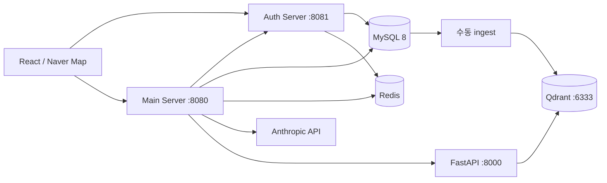

# 자취인 · Jachwi-in

자취생을 위한 지도 기반 건물 탐색, AI 추천, 커뮤니티 서비스입니다.
React · Spring Boot · FastAPI를 모노레포로 관리하며, 원래 서비스별 Git 이력은 보존합니다.

## 구성과 아키텍처

| 디렉터리 | 역할 | 로컬 포트 |
|---|---|---|
| `Jachwi_in-Web-React` | React/Vite 지도, AI 채팅, 커뮤니티 | 5173 |
| `Jachwi_in-Auth-Server` | Spring Boot 3.1 / Java 17, 회원가입·메일 인증·JWT | 8081 |
| `Jachwi_in-Server-Spring` | Spring Boot 3.1 / Java 17, 지도·게시글·추천 | 8080 |
| `Jachwi_in-FastAPI` | 문장 임베딩, Qdrant 검색·적재 | 8000 |
| `jachwiin-scripts` | 공공 실거래 데이터 적재 등 운영 스크립트 | — |
| `Jachwi_in-Embedding-Benchmark` | 별도 벤치마크 프로젝트; 앱 실행과 무관 | — |



Auth가 사용자를 관리하고, Main은 사용자 정보를 Auth 내부 API로 조회합니다.
JWT 서명 키는 두 서버에서 동일해야 합니다. Redis는 이메일 인증 코드와 LLM 응답 캐시에 사용합니다.
DB 구조는 [ERD](docs/erd.md), 공간 설계·업그레이드는 [공간 데이터 문서](docs/spatial.md)를 참고하세요.

## 로컬 실행

필수: Docker Compose v2, 프론트엔드용 Node.js 22.12 이상. JVM을 직접 실행할 때는 Java 17을 사용하세요.

1. Main 서비스 디렉터리에서 환경변수 파일을 준비합니다.

   ```bash
   cd Jachwi_in-Server-Spring
   cp .env.example .env
   ```

   `.env`의 `JWT_SECRET`(최소 32자), `CLAUDE_API_KEY`, `MAIL_USERNAME`, `MAIL_PASSWORD`를 채웁니다.
   Gmail에는 일반 계정 비밀번호 대신 앱 비밀번호를 사용합니다. `.env`는 커밋하지 않습니다.
   Compose에 기본 설정된 MySQL `root/root`는 로컬 개발 전용입니다.

2. 서버와 인프라를 실행합니다.

   ```bash
   docker compose up -d --build
   docker compose ps
   ```

   MySQL은 호스트 `localhost:3307`, 컨테이너 사이에서는 `mysql:3306`, DB 이름은 `jachwiin_db`입니다.
   Redis는 6379, Qdrant는 6333을 사용합니다. 임베딩 모델 최초 다운로드로 FastAPI 기동이 늦어질 수 있습니다.
   새 MySQL 볼륨에는 `schema.sql`이 자동 적용됩니다. **기존 볼륨은 자동 업그레이드되지 않습니다.**
   기존 DB는 서버 기동 전에 [마이그레이션 절차](docs/spatial.md#기존-db-업그레이드)를 진행하세요.
   Hibernate `ddl-auto=update`만으로 공간 컬럼/인덱스를 설치할 수 없습니다.

3. 빈 개발 DB에만 선택적으로 더미 데이터를 넣습니다. 파일의 기존 사용자/건물 ID를 사용하므로 운영 DB에는 실행하지 마세요.

   ```bash
   docker compose exec -T mysql sh -c 'exec mysql --default-character-set=utf8mb4 -uroot -p"$MYSQL_ROOT_PASSWORD" jachwiin_db' < src/main/resources/dummy_data.sql
   docker compose exec embedding-service python -m scripts.ingest
   ```

   기존 데이터가 있다면 더미 적재는 생략하고 ingest만 실행합니다.
   Qdrant ID는 `building.id`를 사용합니다. 건물 변경 후 ingest를 다시 실행해야 하며,
   삭제된 건물의 벡터 정리는 별도입니다. 미색인/검색 장애 시 DB 폴백을 사용합니다.

4. 다른 터미널에서 프론트엔드를 실행합니다.

   ```bash
   cd Jachwi_in-Web-React
   cp .env.example .env.local
   npm ci
   npm run dev
   ```

   `VITE_NAVER_MAP_CLIENT_ID`에 Naver Cloud **Web Dynamic Map**용 ID를 설정합니다.
   기본 Auth/Main URL은 각각 `http://localhost:8081`, `http://localhost:8080`입니다.
   배포 시 양쪽 서버의 `CORS_ALLOWED_ORIGINS`와 프론트 API URL을 실제 도메인으로 변경하세요.

컨테이너 대신 JVM으로 실행할 때는 각 서비스에서 `bash gradlew bootRun`을 사용합니다.
`SPRING_DATASOURCE_URL=jdbc:mysql://localhost:3307/jachwiin_db`, `SPRING_DATASOURCE_USERNAME`,
`SPRING_DATASOURCE_PASSWORD`, `REDIS_HOST`, `REDIS_PORT`, 위 인증/API 환경변수를 셸에 설정하세요.
Spring은 Compose용 `.env`를 자동으로 읽지 않습니다. FastAPI 직접 실행 방법은 해당 서비스 README를 참고하세요.

## 공간 데이터와 가격

- `building_type`: `APT`, `OFFICETEL`, `MULTI_FAMILY`, `DETACHED_HOUSE`, `ETC`.
  기존 유형 미상 건물은 `ETC`이며, 원천 데이터를 근거로 ETL에서 보완합니다.
- 건물 가격 요약: `sale_price`, `jeonse_price`, `monthly_rent_deposit`, `monthly_rent`,
  `representative_price_type`, `representative_price`. 단위는 모두 **만원**이며 미확인은 `NULL`입니다.
- `room_listing`은 실제 매물입니다. `trade_type`은 `SALE`, `JEONSE`, `MONTHLY_RENT`이고,
  건물 요약값과 실제 매물 가격은 구분합니다. `building_trade`는 통합 실거래 이력을 위한 테이블입니다.
  기존 `apt_trade`와 적재 스크립트는 유지되며 자동 통합/가격 요약 배치는 아직 없습니다.
- 건물과 9종 POI에 `POINT NOT NULL SRID 4326` 저장 생성 컬럼과 `SPATIAL INDEX`를 둡니다.
  `x=경도`, `y=위도`가 입력 원본이며 기존 API/CSV/Qdrant 계약을 유지합니다.
  `location`은 DB가 계산하므로 직접 쓰지 않습니다. JPA 엔티티에는 바이너리 공간 값을 노출하지 않습니다.
- 지도/DB 폴백은 MBR 공간 검색으로 후보를 좁히고 기존 경계 포함 조건을 유지합니다.
  `PoiRepository.countWithinRadius`는 MBR 필터 뒤 `ST_Distance_Sphere`로 반경(미터)을 검사합니다.
  지구 곡률을 반영한 구면 거리이며 도보 이동 거리는 아닙니다.

## 추천 흐름과 현재 한계

1. 지도 뷰포트와 사용자 문장을 `POST /api/v1/llm/chat`에 보냅니다.
2. Claude가 예산·선호·분위기를 추출합니다.
3. FastAPI/Qdrant가 **뷰포트 좌표 필터 + 임베딩 유사도**로 건물 후보를 찾습니다.
4. 검색 결과가 없거나 FastAPI 장애가 나면 같은 뷰포트의 MySQL 건물을 조회하고 시설 수로 점수를 매깁니다.
5. Claude가 후보를 설명하며 지도에 추천 건물을 표시합니다. Redis 응답 캐시와 기존 API 형식은 유지합니다.

현재 추천과 지도는 **건물 중심**입니다. 새 매물 테이블은 스키마/엔티티/조회 저장소까지 준비했으며,
추천 API를 `AVAILABLE room_listing JOIN building` 기반으로 전환하거나 거래 유형별 실제 예산 필터를
적용하는 기능은 아직 없습니다. 새 건물 가격 필드를 LLM/Qdrant에 자동 전달하거나 가격을 생성하지 않습니다.
기존 추천 프롬프트의 임대료 추측 금지 동작도 유지합니다.

주변 시설 수는 기존 건물의 사전 집계 필드를 계속 사용합니다. POI 실시간 반경 조회는 제공하지만,
자동 재집계 스케줄러는 없습니다. 사전 집계는 요청 비용을 줄이는 대신 최신성·갱신 비용을 관리해야 합니다.
공간 인덱스도 모든 거리 함수를 자동 가속하지 않으므로 데이터 규모에 맞게 `EXPLAIN ANALYZE`로 확인하세요.
Qdrant는 선호 검색, MySQL은 정형 데이터/공간 조회를 맡으며 색인 동기화는 명시적으로 수행합니다.

## 테스트와 빌드

```bash
cd Jachwi_in-Server-Spring
bash gradlew test bootJar
cd ../Jachwi_in-Auth-Server
bash gradlew test bootJar
cd ../Jachwi_in-Web-React
npm run build
```

Main의 MySQL 통합 테스트는 `SPATIAL_TEST_URL`이 있을 때만 실행됩니다.
그 변수가 없으면 공간 테스트는 **skip**되므로 단순 빌드 성공과 공간 검증을 구분하세요.
[격리된 MySQL 테스트 실행법](docs/spatial.md#테스트)을 제공합니다.
Auth에는 현재 테스트 소스가 없으며 `test`는 NO-SOURCE입니다.

## 비밀정보 관리

현재 Auth의 SMTP 설정은 `MAIL_USERNAME`/`MAIL_PASSWORD` 환경변수를 참조합니다.
`.env.*`(예제 제외)와 `application-local.properties`는 Git에서 제외합니다.
과거에 커밋된 Gmail 앱 비밀번호는 설정 파일을 고치는 것만으로 무효화되지 않습니다.
계정 소유자가 **기존 앱 비밀번호를 폐기하고 새로 발급**해야 합니다.
공유 Git 이력 재작성/강제 push는 이 변경에 포함하지 않습니다.
