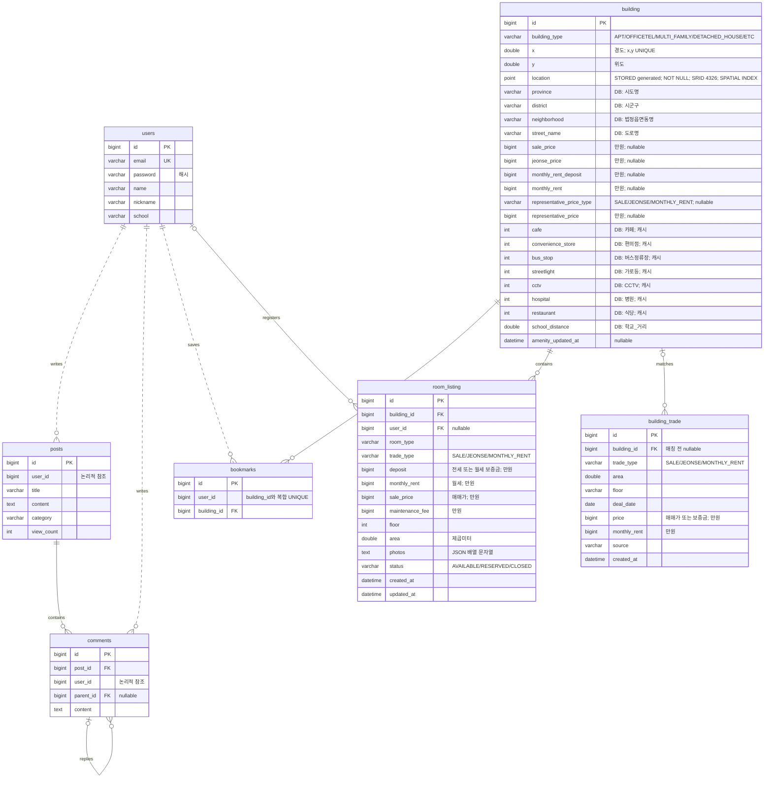
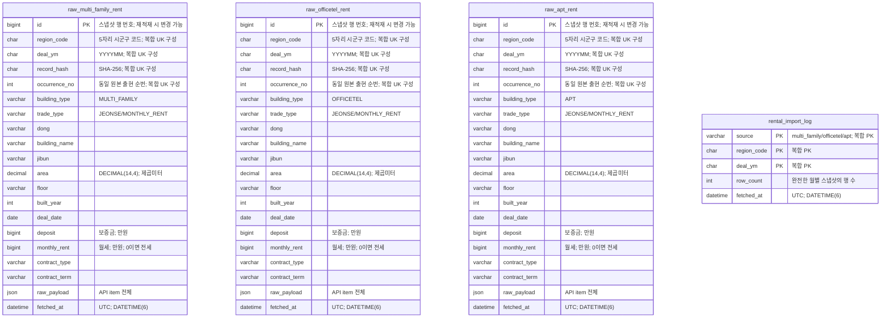
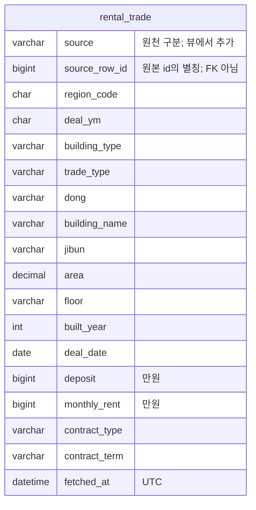
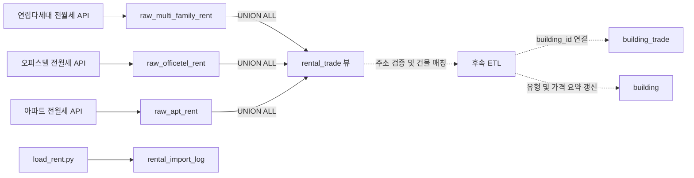

# ERD — 구현된 스키마와 확장 테이블

기준: 서비스 테이블은 `Jachwi_in-Server-Spring/src/main/resources/schema.sql`,
전월세 원본·적재 이력·통합 뷰는 `jachwiin-scripts/load_rent.py`의 `ensure_schema()`입니다.
저장소의 스키마 정의를 표현하며, 기존 DB의 서비스 테이블은 별도 마이그레이션 적용 여부를 확인해야 합니다.
아래는 핵심 컬럼을 요약한 Mermaid ERD입니다. 전체 컬럼/제약/인덱스는 DDL이 기준입니다.
실선 관계는 DDL의 FK, `users`와 게시글/댓글/북마크의 점선 관계는 기존의 논리적 참조입니다.

## POI (공간 관계, building FK 없음)

POI는 여러 건물에서 공유하는 위치 데이터입니다. 특정 건물의 자식 행이 아니며 반경으로 연결합니다.
각 테이블에 `id PK`, `name`, `x`, `y`, `location`, `source`, `created_at`을 둡니다.
`name`은 CCTV/가로등 등을 위해 nullable입니다. location은 모두 생성 컬럼 + SRID 4326 공간 인덱스입니다.

건물 시설 카운트와 `amenity_updated_at`은 캐시이며 자동 계산 트리거/배치는 아직 없습니다.
현재 추천은 기존 캐시값을 사용하고 학교 거리의 기존 의미도 바꾸지 않습니다.
지하철역·학교 POI를 추가했다고 자동으로 사용자별 거리 추천이 활성화되지는 않습니다.

기존 `apt_trade`는 별도 원천 테이블로 `AptTrade` 엔티티와 적재 스크립트가 계속 사용합니다.
그 테이블의 DDL은 `jachwiin-scripts/load_apt_csv.py` / `load_apt_trade.py`에 있으며
`building_trade`로 자동 이전하지 않습니다. 건물 유형은 building이 소유합니다.
이전 기획 ERD의 building_review/user_preference/chat_session/chat_message는 현재 DDL/API에
구현되어 있지 않아 이 문서에서 구현 완료로 표시하지 않습니다.

## 전월세 실거래 원본과 적재 이력

원천 API별로 같은 구조의 테이블을 사용합니다. 원본 실거래는 건물 주소 매칭 전 데이터이므로
`building_id` FK가 없습니다. 아래 독립 테이블 사이에도 물리적 FK는 없습니다.
`rental_import_log`는 `(source, region_code, deal_ym)` 단위의 마지막 성공 적재를 기록합니다.

원본 테이블 각각의 인덱스는 다음과 같습니다.

| 인덱스 | 컬럼 | 의미 |
|---|---|---|
| PRIMARY KEY | id | 해당 스냅샷 행 번호 |
| uk_snapshot_record (UNIQUE) | region_code, deal_ym, record_hash, occurrence_no | 동일 공개 내용의 별개 계약도 출현 횟수만큼 보존 |
| idx_rent_region_date | region_code, deal_date | 지역·계약일 조회 |
| idx_rent_type | trade_type | 전세/월세 조회 |

적재기는 원천·지역·월별 데이터를 하나의 트랜잭션으로 교체하고 적재 이력을 갱신합니다.
재실행 시 행 수가 누적되지 않으며, 원본 `id`는 외부 FK나 영속 거래 식별자로 사용하지 않습니다.

## 통합 조회 뷰와 데이터 흐름

`rental_trade`는 세 원본을 `UNION ALL`로 조회하는 **뷰**입니다. 별도 저장 테이블이나 FK가 없으며,
`(source, source_row_id)`는 현재 스냅샷에서 원본 행을 찾는 조합일 뿐 DB의 PK 제약이 아닙니다.
`record_hash`, `occurrence_no`, `raw_payload`는 원본 테이블에만 있습니다.

아래 화살표는 데이터 처리 흐름이며 FK 관계가 아닙니다. 점선은 아직 구현하지 않은 후속 단계입니다.

공공 실거래 원본은 과거 계약 기록입니다. 현재 구할 수 있는 매물인 `room_listing`과 구분하며,
원본 적재만으로 매물 생성·건물 매칭·건물 가격 요약 갱신을 수행하지 않습니다.
원본의 `building_type`은 API 종류를 나타내고, 건물 마스터의 유형은 검증된 매칭 이후 반영합니다.
상세한 수집 범위, 재실행 방식과 조회 예시는 [전월세 적재 안내](rental-import.md)를 참고하세요.
