# ERD — 구현된 스키마와 확장 테이블

기준: `Jachwi_in-Server-Spring/src/main/resources/schema.sql`.
아래는 핵심 컬럼을 요약한 Mermaid ERD입니다. 전체 컬럼/제약/인덱스는 DDL이 기준입니다.
실선 관계는 DDL의 FK, `users`와 게시글/댓글/북마크의 점선 관계는 기존의 논리적 참조입니다.

## POI (공간 관계, building FK 없음)

POI는 여러 건물에서 공유하는 위치 데이터입니다. 특정 건물의 자식 행이 아니며 반경으로 연결합니다.
각 테이블에 `id PK`, `name`, `x`, `y`, `location`, `source`, `created_at`을 둡니다.
`name`은 CCTV/가로등 등을 위해 nullable입니다. location은 모두 생성 컬럼 + SRID 4326 공간 인덱스입니다.

```mermaid
erDiagram
    cafe {
        bigint id PK
        double x
        double y
        point location "SRID 4326; SPATIAL"
    }
    convenience_store {
        bigint id PK
        double x
        double y
        point location "SRID 4326; SPATIAL"
    }
    hospital {
        bigint id PK
        double x
        double y
        point location "SRID 4326; SPATIAL"
    }
    restaurant {
        bigint id PK
        double x
        double y
        point location "SRID 4326; SPATIAL"
    }
    cctv {
        bigint id PK
        double x
        double y
        point location "SRID 4326; SPATIAL"
    }
    streetlight {
        bigint id PK
        double x
        double y
        point location "SRID 4326; SPATIAL"
    }
    school {
        bigint id PK
        varchar school_level
        double x
        double y
        point location "SRID 4326; SPATIAL"
    }
    subway_station {
        bigint id PK
        varchar line
        double x
        double y
        point location "SRID 4326; SPATIAL"
    }
    bus_stop {
        bigint id PK
        varchar stop_id
        varchar routes
        double x
        double y
        point location "SRID 4326; SPATIAL"
    }
```

건물 시설 카운트와 `amenity_updated_at`은 캐시이며 자동 계산 트리거/배치는 아직 없습니다.
현재 추천은 기존 캐시값을 사용하고 학교 거리의 기존 의미도 바꾸지 않습니다.
지하철역·학교 POI를 추가했다고 자동으로 사용자별 거리 추천이 활성화되지는 않습니다.

기존 `apt_trade`는 별도 원천 테이블로 `AptTrade` 엔티티와 적재 스크립트가 계속 사용합니다.
그 테이블의 DDL은 `jachwiin-scripts/load_apt_csv.py` / `load_apt_trade.py`에 있으며
`building_trade`로 자동 이전하지 않습니다. 건물 유형은 building이 소유합니다.
이전 기획 ERD의 building_review/user_preference/chat_session/chat_message는 현재 DDL/API에
구현되어 있지 않아 이 문서에서 구현 완료로 표시하지 않습니다.
